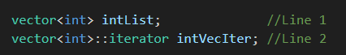
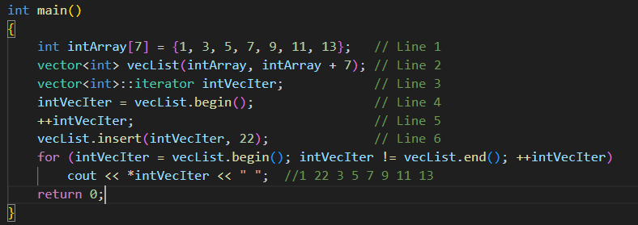
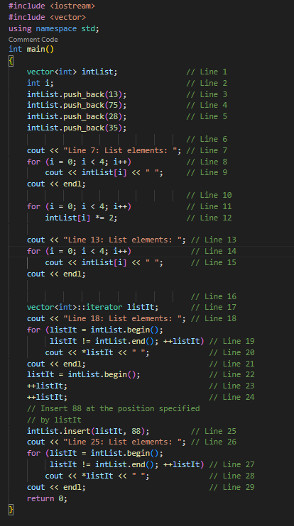
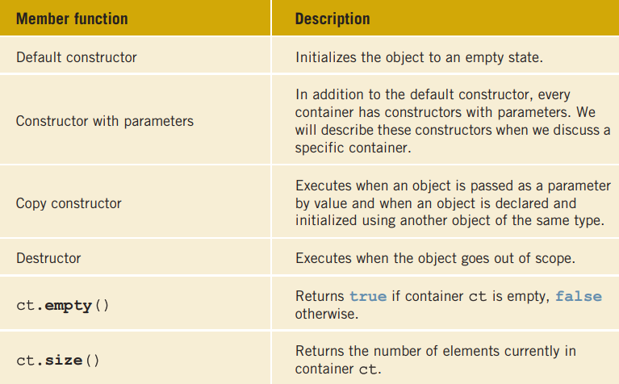
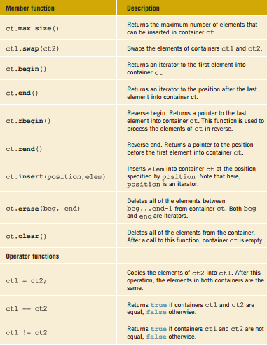
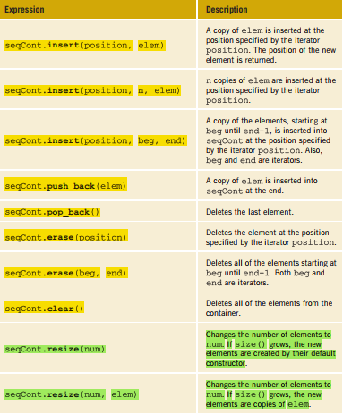
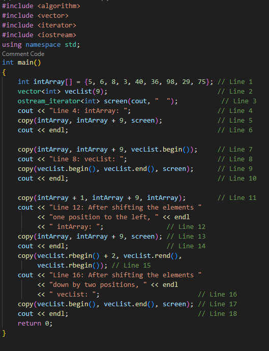

# C-plus-plus-PROGRAMMING-PROGRAM-DESIGN-INCLUDING-DATA-STRUCTURES
 # CH 21 :: STANDARD TEMPLATE LIBRARY (STL)
##  Components of the STL

  * The main objective of a program is to manipulate data and generate results. Achieving
this goal requires the ability to store data into computer memory, access a particular piece
of data, and write algorithms to manipulate the data.

* For example, if all data items are of the same type and we have some idea of the number
of data items, we could use an array to store the data. We can then use an index to access
a particular component of the array. Using a loop and the array index, we can step
through the elements of the array. Algorithms, such as those for initializing the array,
sorting, and searching, are used to manipulate the data stored in an array. On the other
hand, if we do not want to be concerned about the size of the data, we can use a linked
list to process it. If the data needs to be processed in a Last In First Out (LIFO) manner,
we can use a stack. Similarly, if the data needs to be processed in a First In First Out
(FIFO) manner, we can use a queue .

* The STL is equipped with these features to effectively manipulate data. More formally,
the STL has three main components:
   * Containers
   * Iterators
   * Algorithms.
* Containers and iterators are class templates. Iterators are used to step through the elements
of a container. Algorithms are used to manipulate data. 
## Container Types 
* Containers are used to manage objects of a given type. The STL containers are classified
into three categories, as follows:
     * Sequence containers (also called sequential containers)
     * Associative containers
     * Container adapters
### Sequence Containers
Every object in a sequence container has a specific position. The three predefined
sequence containers are:
     { vector - deque - list }
 * Before discussing container types in general, let us first briefly describe the sequence
container vector. We do so because vector containers are similar to arrays and thus can
be processed like arrays. Also, with the help of vector containers, we can describe several
properties that are common to all containers. In fact, all containers use the same names for
the common operations. Of course, there are operations that are specific to a container,
which will be discussed when describing a specific container.
#### Sequence Container: vector
* A vector container stores and manages its objects in a dynamic array. Because an array is a
random access data structure, the elements of a vector can be accessed randomly. Item insertion in the middle or beginning of an array is time consuming, especially if the array
is large. However, inserting an item at the end is quite fast.
* The name of the class that implements the vector container is vector. (Recall that containers are class templates.) The name of the header file containing the class
vector is vector. Thus, to use a vector container in a program, the program must
include the following statement:
> #include <vector<vector>>  

Furthermore, to define an object of type vector, we must specify the type of the object
because the class vector is a class template. For example, the statement:
> vector <int<int>> intList;

declares intList to be a vector and the component type to be int. Similarly

> vector<string<string>> stringList;

declares stringList to be a vector container and the component type to be string.

##### DECLARING VECTOR OBJECTS
* The class vector contains several constructors, including the default constructor.
Therefore, a vector container can be declared and initialized several ways. Table 21-1
describes how a vector container of a specific type can be declared and initialized Methods.

* Now that we know how to declare a vector sequence container, let us discuss how to
manipulate the data stored in a vector container. In order to manipulate the data in a vector container, we must know the following basic operations:
    * Item insertion
    * Item deletion
    * Stepping through the elements of a vector container

EXAMPLE 21-1(Recall that in C++, arrays start at location 0. Similarly, the first element in a vector container is at location 0.)
Consider the following statement, which declares intList to be a vector container of
size 5 with an element type of int:

> vector<int.> intList(5);

You can use a loop, such as the following, to store elements into intList:
>for (int j = 0; j < 5; j++) \
intList[j] = j;

Similarly, you can use a for loop to output the elements of intList

* The class vector also contains member functions that can be used to find the number
of elements currently in the container, the maximum number of elements that can be
inserted into a container, and so on. Table 21-3 describes some of these operations. The
name of the function is shown in bold. (Suppose that vecCont is a vector container.)

* The class vector also contains member functions that can be used to manipulate the
data, as well as insert and delete items, in a vector container. Suppose that vecList is a container of type vector. Item insertion and deletion in vecList are accomplished using the operations given in Table 21-4. These operations are implemented as member functions of the class vector and are shown in bold. Table 21-4 also shows how these operations are used.

               

EXAMPLE 21-2
The following statement declares intList to be a vector object of size 0:
>vector<int.> intList;

To add elements to intList, we can use the function push_back as follows:
> intList.push_back(34);\
>intList.push_back(55);

After these statements execute, the size of intList is 2 and:
>intList = {34, 55}

In Example 21-2, because intList is declared to be of size 0, we use the function
push_back to add elements to intList. However, we can also use the resize
function to increase the size of intList and then use the array subscripting operator.
For example, suppose that intList is declared as in Example 21-2. Then, the following
statement sets the size of intList to 10:

>intList.resize(10);

Similarly, the following statement increases the size of intList by 10:

>intList.resize (intList.size() + 10);

However, at times, the push_back function is more convenient because it does not
need to know the size of the vector; it simply adds the elements at the end.
Next, we describe how to declare an iterator in a vector container.

#### DECLARING AN ITERATOR TO A VECTOR CONTAINER
----------------------------------------

The class vector contains a typedef iterator, which is declared as a public
member. An iterator to a vector container is declared using the typedef iterator. For
example, the statement:
> vector<*int*>::iterator intVecIter;

declares *intVecIter* to be an iterator in a vector container of type int.

Because iterator is a typedef defined inside the class vector, we must use the
container name (which is vector), the container element type, and the scope resolution
operator to use the typedef iterator.
The expression:
> ++intVecIter

advances the iterator intVecIter to the next element in the container, and the expression:
> *intVecIter 

returns the element at the current iterator position.

Suppose that we have the following statements:

The statement in Line 1 declares intList to be a vector container, and the element type
is int. The statement in Line 2 declares intVecIter to be an iterator in a vector
container whose element type is int.

#### CONTAINERS AND THE FUNCTIONS begin AND end
------
Every container has the member functions *begin* and end. *The function begin returns
the position of the first element in the container*

the function *end* returns the position of
one past the last element in the container. Also, these functions have no parameters.

After the following statement executes:
> intVecIter = intList.begin();

the iterator *intVecIter* points to the first element in the container intList.

The following for loop outputs the elements of intList to the standard output device.
> for (intVecIter = intList.begin(); intVecIter != intList.end();
++intVecIter)\
cout << *intVecIter << " " ;

EXAMPLE 21-3

   * The statement in Line 2 declares and initializes the vector container vecList.

   * The statement in Line 4 initializes the iterator intVecIter to the first element of
vecList; the statement in Line 5 advances intVecIter to the second element of
vecList. The statement in Line 6 inserts 22 at the position specified by intVecIter.
* After the statement in Line 6 executes, vecList = {1, 22, 3, 5, 7, 9, 11, 13}.
Notice that the size of the container also increases.

EXAMPLE 21-4

Sample Run:

Line 7: List elements: 13 75 28 35

Line 13: List elements: 26 150 56 70

Line 18: List elements: 26 150 56 70

Line 25: List elements: 26 150 88 56 70

* The statement in Line 1 declares a vector container (or vector for short), intList, of
type int. 

* The statement in Line 2 declares i to be an int variable.

* The statements in Lines 3 through 6 use the operation push_back to insert four numbers—13, 75, 28, and 35—into intList. The statements in Lines 8 and 9 use the for loop and the array
subscripting operator, [], to output the elements of intList. In the output, see the line
marked Line 7, which contains the output of Lines 7 through 10. The statements in Lines
11 and 12 use a for loop to double the value of each element of intList; the
statements in Lines 14 and 15 output the elements of intList. In the output, see the
line marked Line 13, which contains the output of Lines 13 through 16.

* The statement in Line 17 declares listIt to be a vector iterator that processes any
vector container whose elements are of type int. Using the iterator listIt, the
statements in Lines 19 and 20 output the elements of intList.

* After the statement in
Line 22 executes, listIt points to the first element of intList. The statements in
Lines 23 and 24 advance listIt twice; after these statements execute,listIt points to the third element of intList. The statement in Line 25 inserts 88 into intList at the
position specified by the iterator listIt. Because listIt points to the component at
position 2 (the third element of intList), 88 is inserted at position 2 in intList; that
is, 88 becomes the third element of intList. The statements in Lines 27 and 28 output
the modified intList.

### Member Functions Common to All Containers
---  --- 
The previous section discussed vector containers. This section discusses operations that
are common to all containers. For example, every container class has the default constructor, several constructors with parameters, the destructor, a function to insert an
element into a container, and so on.

Table 21-5 describes the member functions that are common to all containers; that is,
these functions are included as members of the class template implementing the container,Suppose ct, ct1, and ct2 are containers of the same type.

### Member Functions Common to Sequence Containers
---
The previous section described the member functions that are common to all containers. In
addition to these member functions, Table 21-6 describes the member functions that are
common to all sequence containers, that is, containers of type *vector, deque, and list*.
(Suppose that seqCont is a sequence container.)

 ### The *copy* Algorithm
 ----

Example 21-4 used a for loop to output the elements of a vector container. The STL
provides a convenient way to output the elements of a container with the help of the
function copy. The function copy is provided as a part of the generic algorithm and can
be used with any container type. Because we frequently need to output the elements of a
container.

The function copy does more than output the elements of a container. In general, it
allows us to copy the elements from one place to another. For example, to output the
elements of a vector or to copy the elements of a vector into another vector, we can use
the function copy. 

The prototype of the function template copy is:

> template <*class inputIterator, class outputIterator*>\
outputIterator copy(inputIterator first1, inputIterator last, outputIterator first2);

 The parameter first1 specifies the position from which to *begin* copying the elements;
the parameter *last* specifies the end position

Therefore, the parameters first1 and last specify the source ; parameter first2 specifies the destination.

The definition of the function template copy is contained in the header file algorithm.
Thus, to use the function copy, the program must include the statement:
> #include <*algorithm*>

The function copy works as follows. Consider the following statement:

> int intArray[] = {5, 6, 8, 3, 40, 36, 98, 29, 75} ;

This statement creates an array intArray of nine components. Here, intArray[0] = 5,
intArray[1] = 6, and so on.

The statement:

> vector<*int*> vecList(9) ;

creates an empty container of nine components of type vector and the element type int.

Now consider the statement:

> copy(intArray, intArray + 9, vecList.begin()) ;

This statement copies the elements starting at the location intArray, which is the first
component of the array intArray, until intArray + 9 - 1 (that is, intArray + 8)

which is the last element of the array intArray, into the container vecList. (Note that
here, first1 is intArray, last is intArray + 9, and first2 is vecList.begin().)
After the previous statement executes:

> vecList = {5, 6, 8, 3, 40, 36, 98, 29, 75}

Next, consider the statement:

> copy (intArray + 1, intArray + 9, intArray) ;

Here, first1 is intArray + 1; that is, first1 points to the location of the second
element of the array intArray, and last is intArray + 9. Also, first2 is intArray;
that is, first2 points to the location of the first element of the array intArray. Therefore,
the second array element is copied into the first array component, the third array element
into the second array component, and so on. After the preceding statement executes:

>intArray = {6, 8, 3, 40, 36, 98, 29, 75, 75}

Clearly, the elements of the array intArray are *shifted to the left by one position*.

Now consider the statement:

> copy (vecList.rbegin() + 2, vecList.rend(), vecList.rbegin());

Recall that the function rbegin (reverse begin) returns a pointer to the last element into
a container; it is used to process the elements of a container in reverse. Therefore,
vecList.rbegin() + 2 returns a pointer to the third-to-last element into the container vecList. Similarly, the function rend (reverse end) returns a pointer to the first
element into a container. The previous statement shifts the elements of the container
vecList to the right by two positions. After the previous statement executes, the
container vecList is:

> vecList = {5, 6, 5, 6, 8, 3, 40, 36, 98}

Example 21-5 shows the effect of the preceding statements using a C++ program. Before
discussing Example 21-5, let us describe a special type of iterators called ostream
iterators. These iterators work well with the function copy to copy the elements of a
container to an output device.

#### THE ostream ITERATOR AND THE FUNCTION copy
****

One way to output the contents of a container is to use a for loop, the function begin
to initialize the for loop control variable, and the function end to set the limit.
Alternatively, the function copy can be used to output the elements of a container. In
this case, an iterator of type ostream specifies the destination. (ostream iterators are
discussed in detail later in this chapter.) When we create an iterator of type ostream, we
also specify the type of element that the iterator will output.
The following statement illustrates how to create an ostream iterator of type int:

> ostream_iterator<int> screen(cout, " "); //Line A

This statement creates screen to be an ostream iterator with the element type int.
The iterator screen has two arguments: the object cout and a space. Thus, the iterator
screen is initialized using the object cout. When this iterator outputs elements, they
are separated by a space.

The statement:

>copy(intArray, intArray + 9, screen);

outputs the elements of intArray on the screen.
Similarly, the statement:

> copy ( vecList.begin( ), vecList.end( ), screen ) ;

outputs the elements of the container vecList on the screen.

> copy(vecList.begin(), vecList.end(), screen);

is equivalent to the statement:

> copy(vecList.begin(), vecList.end(),
ostream_iterator<int>(cout, " ")) ;

Finally, the statement:

> copy ( vecList.begin(), vecList.end(),
ostream_iterator<int>(cout, ", ") );

outputs the elements of vecList with a comma and space between them.

Example 21-5 shows how to use the function copy and an ostream iterator in a program

Sample Run:

Line 4: intArray: 5 6 8 3 40 36 98 29 75

Line 8: vecList: 5 6 8 3 40 36 98 29 75

Line 12: After shifting the elements one position to the left,

intArray: 6 8 3 40 36 98 29 75 75

Line 16: After shifting the elements down by two positions,

vecList: 5 6 5 6 8 3 40 36 98

