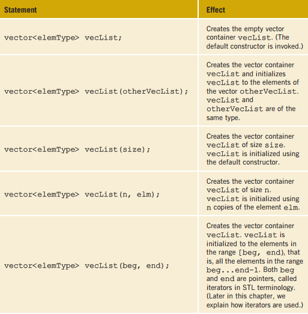
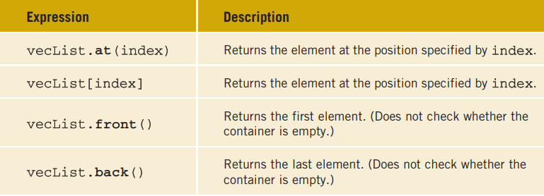
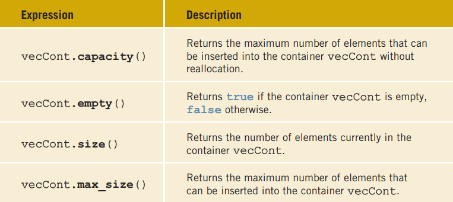
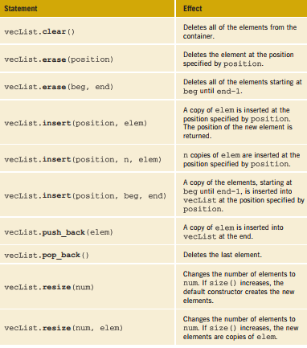

# C-plus-plus-PROGRAMMING-PROGRAM-DESIGN-INCLUDING-DATA-STRUCTURES
 # CH 21 :: STANDARD TEMPLATE LIBRARY (STL)
##  Components of the STL

  * The main objective of a program is to manipulate data and generate results. Achieving
this goal requires the ability to store data into computer memory, access a particular piece
of data, and write algorithms to manipulate the data.

* For example, if all data items are of the same type and we have some idea of the number
of data items, we could use an array to store the data. We can then use an index to access
a particular component of the array. Using a loop and the array index, we can step
through the elements of the array. Algorithms, such as those for initializing the array,
sorting, and searching, are used to manipulate the data stored in an array. On the other
hand, if we do not want to be concerned about the size of the data, we can use a linked
list to process it. If the data needs to be processed in a Last In First Out (LIFO) manner,
we can use a stack. Similarly, if the data needs to be processed in a First In First Out
(FIFO) manner, we can use a queue .

* The STL is equipped with these features to effectively manipulate data. More formally,
the STL has three main components:
   * Containers
   * Iterators
   * Algorithms.
* Containers and iterators are class templates. Iterators are used to step through the elements
of a container. Algorithms are used to manipulate data. 
## Container Types 
* Containers are used to manage objects of a given type. The STL containers are classified
into three categories, as follows:
     * Sequence containers (also called sequential containers)
     * Associative containers
     * Container adapters
### Sequence Containers
Every object in a sequence container has a specific position. The three predefined
sequence containers are:
     { vector - deque - list }
 * Before discussing container types in general, let us first briefly describe the sequence
container vector. We do so because vector containers are similar to arrays and thus can
be processed like arrays. Also, with the help of vector containers, we can describe several
properties that are common to all containers. In fact, all containers use the same names for
the common operations. Of course, there are operations that are specific to a container,
which will be discussed when describing a specific container.
#### Sequence Container: vector
* A vector container stores and manages its objects in a dynamic array. Because an array is a
random access data structure, the elements of a vector can be accessed randomly. Item
insertion in the middle or beginning of an array is time consuming, especially if the array
is large. However, inserting an item at the end is quite fast.
* The name of the class that implements the vector container is vector. (Recall that containers are class templates.) The name of the header file containing the class
vector is vector. Thus, to use a vector container in a program, the program must
include the following statement:
> #include <vector<vector>>  ;

Furthermore, to define an object of type vector, we must specify the type of the object
because the class vector is a class template. For example, the statement:
> vector <int<int>> intList;

declares intList to be a vector and the component type to be int. Similarly

> vector<string<string>> stringList;

declares stringList to be a vector container and the component type to be string.

##### DECLARING VECTOR OBJECTS
* The class vector contains several constructors, including the default constructor.
Therefore, a vector container can be declared and initialized several ways. Table 21-1
describes how a vector container of a specific type can be declared and initialized Methods.

* Now that we know how to declare a vector sequence container, let us discuss how to
manipulate the data stored in a vector container. In order to manipulate the data in a vector container, we must know the following basic operations:
    * Item insertion
    * Item deletion
    * Stepping through the elements of a vector container

EXAMPLE 21-1(Recall that in C++, arrays start at location 0. Similarly, the first element in a vector container is at location 0.)
Consider the following statement, which declares intList to be a vector container of
size 5 with an element type of int:

> vector<int.> intList(5);

You can use a loop, such as the following, to store elements into intList:
>for (int j = 0; j < 5; j++) \
intList[j] = j;

Similarly, you can use a for loop to output the elements of intList

* The class vector also contains member functions that can be used to find the number
of elements currently in the container, the maximum number of elements that can be
inserted into a container, and so on. Table 21-3 describes some of these operations. The
name of the function is shown in bold. (Suppose that vecCont is a vector container.)

* The class vector also contains member functions that can be used to manipulate the
data, as well as insert and delete items, in a vector container. Suppose that vecList is a container of type vector. Item insertion and deletion in vecList are accomplished using the operations given in Table 21-4. These operations are implemented as member functions of the class vector and are shown in bold. Table 21-4 also shows how these operations are used.

               

EXAMPLE 21-2
The following statement declares intList to be a vector object of size 0:
>vector<int.> intList;

To add elements to intList, we can use the function push_back as follows:
> intList.push_back(34);\
>intList.push_back(55);

After these statements execute, the size of intList is 2 and:
>intList = {34, 55}

In Example 21-2, because intList is declared to be of size 0, we use the function
push_back to add elements to intList. However, we can also use the resize
function to increase the size of intList and then use the array subscripting operator.
For example, suppose that intList is declared as in Example 21-2. Then, the following
statement sets the size of intList to 10:

>intList.resize(10);

Similarly, the following statement increases the size of intList by 10:

>intList.resize(intList.size() + 10);

However, at times, the push_back function is more convenient because it does not
need to know the size of the vector; it simply adds the elements at the end.
Next, we describe how to declare an iterator in a vector container.